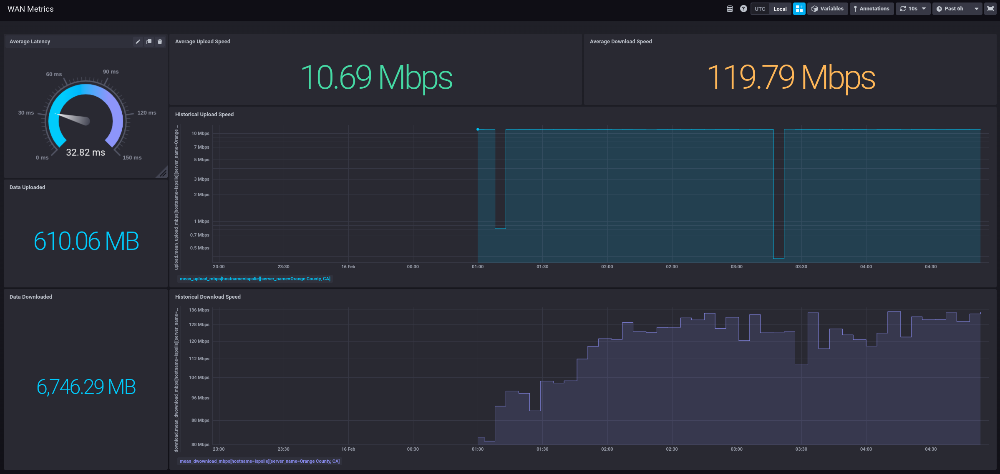

# ISPs Lie!

A simple continuous speedtest utility to track up/download speeds from your ISP.

## Dependencies

- InfluxDB 1.x server

## Configuration

`ispslie` is configured primarily via environment variables.

| Name                                | Values                      | Default                 |
| ----------------------------------- | --------------------------- | ----------------------- |
| `ISPSLIE_SPEEDTEST_SERVER`          | `<path to JSON file>`       | None                    |
| `ISPSLIE_SPEEDTEST_THREADS`         | `<int>`                     | 1                       |
| `ISPSLIE_INFLUXDB_DATABASE`         | `<str>`                     | `wan_speed`             |
| `ISPSLIE_INFLUXDB_RETENTION_POLICY` | `<str>`                     | `autogen`               |
| `ISPSLIE_INFLUXDB_URI`              | `http://<server>:<port>`    | `http://localhost:8086` |
| `ISPSLIE_WRITE_PRECEISION`          | `ns` \| `ms` \| `s` \| `us` | `s`                     |
| `ISPSLIE_COLLECTION_INTERVAL`       | `<int>` (seconds)           | 300 (5m)                |

## Installation

```shell
pip install <project_dir>
```

## Running

```shell
python -m ispslie
```

### Docker

`ispslie` can also be run using Docker.

```shell
docker run --name ispslie \
  -e ISPSLIE_INFLUXDB_URI=http://<server>:<port> \
  mhill421/ispslie:latest
```

## Chronograf

There is a simple dashboard (`dashboard.json`) included with this app that can be imported into Chronograf.

This dashboard includes the following:

- Latency gauge
- Average Upload Speed (Mbps)
- Historical Upload Speed (Mbps)
- Data Uploaded (MB)
- Average Download Speed (Mbps)
- Historical Download Speed (Mbps)
- Data Downloaded (MB)


